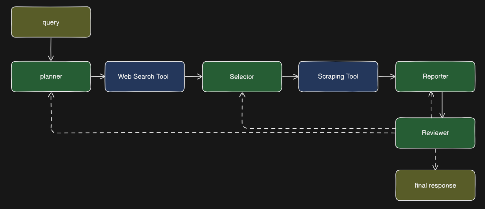

# Web Search Agent

This project is a simple AI agent that receives the user's question and scrapes webpages relevant to the question to give an accurate answer, built with the LangGraph framework.

Tech used: LangChain and LangGraph


## Takeaways

- Fundamentals of AI agents
- How LLMs work
- Development of AI agents with LangGraph
- Basic web scraping

## App Overview

### Graph flow:



### Agents:

Each agent has a file housing its prompt and another for its class. Each agent node involves the calling of the invoke method of each agent object.

- Planner: The planner formulates a plan that utilises the agents and tools in the graph to answer the question posed by the user, then calls the web search tool with a search query.
- Selector: Receives the search results of the query sent to the search engine and selects the most relevant to the user's question, calling the scraper tool to scrape those selected.
- Reporter: Uses information scraped from the websites to answer the user's questions.
- Reviewer: Evaluates the answer and reroutes the graph to the corresponding nodes for improvement depending on the plan and quality of answer.

### Other Folders:

`/states`

- `state.py`: Define state of the graph
- `state_getter.py`: Helper function to get state values safely

`/tools`:

- `serper.py`: Function that returns the results of a search query
- `scraper.py`: Function that scrapes websites and returns content in paragraph elements

`utils`:

- `date.py`: `get_date` function returns current date and time in UTC

## How to use

Set up `.env` file

```
ANTHROPIC_API_KEY=
SERPER_API_KEY=
```

Install dependencies

```
pip install -r requirements.txt
```

Run:

```
python app.py
```

Enter your question (enter "quit" to exit program)

```
Question:
```
